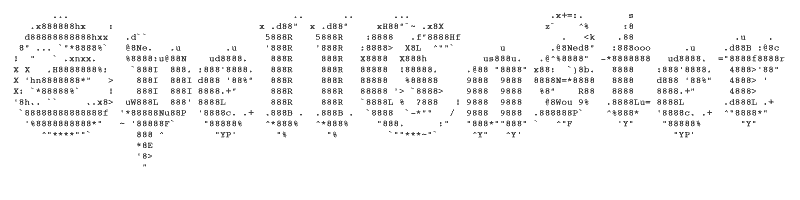

## About

Spellcaster for Cordova-based applications is a native loader that dynamically downloads, stores and loads a server based html file.

## Requirements

- Cordova v3.0+

## Install for iOS

#### Install

- Add SystemConfiguration.framework to your project. 
- Copy classes from `platforms/ios/HelloCordova/Classes/Spellcaster` directory to your project.

#### Usage

- You are no longer required to include an index.html (removal is optional)
- Add `[[Spellcaster alloc] init:self.viewController];` to `- (BOOL)application:(UIApplication*)application didFinishLaunchingWithOptions` method.
- Add your application URL to Cordova's `config.xml` in `<content src=YOUR_URL_HERE>`.

#### Localising your alert messages

Add a *.lproj file into the Resources directory, prefixing the file with your language identifier (for example, Japanese would be ja.lproj).

Inside the *.lproj file should be a Localizable.strings file. The following strings require assignment to change the message in the "connection required" alert dialog: `"CONNECTION_REQUIRED"`, `"NOT_REACHABLE"`, `"RETRYING"`  

## Install for Android

#### Install

- Copy classes from `platforms/android/src/jp/wizcorp/spellcaster` directory to your project.
- Add `<uses-permission android:name="android.permission.ACCESS_NETWORK_STATE" />` to your project's AndroidManifest.xml

#### Usage

- You are no longer required to include an index.html (removal is optional)
- Add the following to your starting Activity

		@Override
		public void onCreate(Bundle savedInstanceState)
		{
			super.onCreate(savedInstanceState);
			super.init();
		}
		
		@Override
		public void init() {
	    	// Set by <content src="index.html" /> in config.xml
	    	Spellcaster spellcaster = new Spellcaster();
	    	spellcaster.init(this, Config.getStartUrl(), appView);
		}
	
		@Override
		public void init(org.apache.cordova.CordovaWebView webView,
	                 org.apache.cordova.CordovaWebViewClient webViewClient,
	                 org.apache.cordova.CordovaChromeClient webChromeClient) {
	    	super.init(webView, webViewClient, webChromeClient);
	
	    	// Set by <content src="index.html" /> in config.xml
	    	Spellcaster spellcaster = new Spellcaster();
	    	spellcaster.init(this, Config.getStartUrl(), webView);
		}

- Add your application URL to Cordova's `config.xml` in `<content src=YOUR_URL_HERE>`.

#### Localising your alert messages

Add a values-* folder into the Res directory, suffixing the folder name with your language identifier (for example, Japanese would be values-ja).

Inside the values-* folder should be a String.xml file. The following strings require assignment to change the message in the "connection required" alert dialog: `"connection_title"` and `"connection_message"`

## How It Works (Step-By-Step)

1. Spellcaster will check for an active internet connection. If one is not found Spellcaster will continue retrying at a set interval.
2. Spellcaster downloads the content of the provided application URL and stores to application cache (overriding any existing loader).
3. Spellcaster injects Cordova script tags just after the `<head>` tag.
4. Spellcaster loads the new loader into the WebView.

